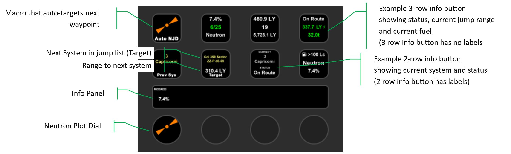

# Neutron Plot User Guide

Have you ever used [Spansh](https://spansh.co.uk) to plot a Neutron Highway route across thousands of light years? If so, you'll know the tedium of copying star systems out of Spansh and pasting them into your Galaxy Map. One… by one… by one.

The **Neutron Plot** button takes that pain away. Load your route once, then step through it from your Stream Deck, with your current target, jumps remaining, refuel stops and neutron stars right under your fingers. It even advances itself as you jump, and can plot a fresh fuel-aware route straight from Spansh without a CSV at all.

---

## Quick Start

There are two ways to get a route onto your Stream Deck. Pick whichever suits you.

### Option A: Auto Plot (no CSV, fuel-aware)

1. Add a **Neutron Plot (3 info rows)** or **(2 info rows)** button to a Stream Deck key.
2. Set its **Function** (or **Long Press**) to **Auto Plot (Spansh)**.
3. In Elite, target your destination system in the Galaxy Map so it shows as your selected FSD target.
4. Press the button. The plugin asks Spansh's plotter for a route from where you are to your target, using your ship's actual fuel and jump characteristics, and loads it automatically.

That's it. No file handling. If Auto Plot can't find a target or the plotter fails, the button flashes an alert and shows a short error (see [Auto Plot statuses](#auto-plot-statuses)); your existing route is left untouched.

### Option B: Load a Spansh CSV

1. On [spansh.co.uk](https://spansh.co.uk), plot a Neutron route and **export it to CSV**.
2. Add a **Neutron Plot** button to a Stream Deck key.
3. In the button settings, under **CSV Route → File**, choose your exported `.csv`.
4. The file is checked automatically. If it's valid, the route loads; if not, it's rejected and the button shows **NO ROUTE**.

Once a route is loaded (either way), set a second button's **Function** to **Next System** and **Copy Current**, and you're ready to fly. As you jump, the target advances on its own, or step it manually any time.

---

## Requirements

- **Elite Dangerous** (otherwise this would be a fairly pointless tool).
- **An Elgato Stream Deck**. A key *or* a dial works, so you're flexible.
- For Option B: the ability to plot a route on **spansh.co.uk** and export it to CSV.
- A working knowledge of configuring buttons in the **Stream Deck application**.

---

## The three Neutron Plot actions

When you drag a button out, you'll find three variants in the action list:

| Action | What it's for |
| --- | --- |
| **Neutron Plot (3 info rows)** | Three stacked info values, **no labels** (densest readout). Great once you know your layout by heart. |
| **Neutron Plot (2 info rows)** | Two info values **with labels** (e.g. `CURRENT`, `STATUS`), easier to read at a glance. |
| **Neutron Plot Dial** | For the Stream Deck **+** dials. Turn to step through the route, press to copy, two-column touch display. |

All three share the **same global route**. Load a CSV (or Auto Plot) on any one of them and every Neutron Plot button and dial updates together.

---

## Configuring a button

### Functions (short press)

Set the **Function** dropdown to choose what a normal press does:

| Function | Action |
| --- | --- |
| **Blank** | Nothing happens (default). |
| **Initialize Route** | Resets your target back to the very first jump. Handy if you've got lost and want to start over. |
| **Previous System** | Steps your target one waypoint back (no further than the origin). |
| **Next System** | Steps your target one waypoint forward (no further than the destination). |
| **Copy Current** | Copies the **target system name** to the clipboard, ready to `CTRL-V` into the Galaxy Map search. |
| **Auto Plot (Spansh)** | Fetches a fresh fuel-aware route from Spansh to your current FSD target. |

### Long Press

A **long press is a hold of 2 seconds or more**. The **Long Press** dropdown offers:

| Long Press | Action |
| --- | --- |
| **Blank** | Nothing (default). |
| **Copy Current** | Same as above; copy target to clipboard. |
| **Auto Plot (Spansh)** | Plot a new route from Spansh. |
| **Clear Route** | Removes the current route and CSV from the plugin entirely. Long-press only, so you can't trigger it by accident. |

> **Tip:** A common setup is **Next System** on short press and **Clear Route** on long press, so one button does most of the flying.

### Clearing the file

The **Clear File** button in settings removes the route globally. Every Neutron Plot button then shows **NO ROUTE** until you load a new one.

---

## Information you can display

You can show up to **three** values on a key (Upper / Mid / Lower), each with its own **colour**. On the **2-row** action each value carries a short label above it (like `STATUS` or `DEST DIST`); the **3-row** action shows values only, for maximum size.

| Value | Label | Description |
| --- | --- | --- |
| **Route Status** | `STATUS` | NO ROUTE / At Origin / On Route / OFF ROUTE / At Dest (see below). |
| **Current System** | `CURRENT` | Your last known position along the route. |
| **Target System Name** | `TARGET` | The system you're jumping to next. |
| **Distance to Destination** | `DEST DIST` | Estimated light years from your current system to the destination. |
| **Distance Travelled** | `TRIP DIST` | Light years covered from the origin to your current system. |
| **Distance to Target** | `TGT DIST` | Light years from your current system to the target. |
| **Current Jump Number** | `JUMP NBR` | Which jump you're on. The origin is jump 0. |
| **Total Jumps** | `JUMPS TOT` | Total jumps in the route. |
| **Jumps Remaining** | `JUMPS LEFT` | Jumps left from your current position. |
| **Jump Summary** | `SUMMARY` | Jump and total together, e.g. `6 / 25`. |
| **Trip Percentage** | `PROGRESS` | How far along the route you are, by distance. |
| **Refuel at Target** | `FUEL STOP` | Shows when your target is a recommended refuel point. |
| **Neutron at Target** | `NEUTRON` | Shows when your target has a neutron star. |
| **Jump Range** | `RANGE` | Your ship's live laden jump range. Shows a **⚡** and switches to the **Boost colour** when an FSD boost (e.g. a neutron supercharge) is active. |
| **Fuel (Main Tank)** | `FUEL` | Current main-tank fuel in tonnes. |

**System names need room**, and the two button types handle that differently:

- **On the 3-row button**, a system name takes up two of the three slots. Put one in the **Upper** slot and it spills into **Mid** (the Mid setting is ignored); put one in **Mid** and it spills into **Lower**. So on the 3-row button you can show **one** system name plus one other value, but not two system names.
- **On the 2-row button**, each row stands on its own and a long system name simply wraps onto two lines *within its own row*. That leaves enough room to put a system name in **both** rows if you want, for example **Current** above and **Target** below.

### Route Status, explained

| Status | Meaning |
| --- | --- |
| **NO ROUTE** | No route is loaded. |
| **At Origin** | You're sitting at the starting system. |
| **On Route** | Your current system matches a waypoint in the route. |
| **OFF ROUTE** | Your current system isn't on the route, so you've wandered off the planned path. |
| **At Dest** | You've reached the final waypoint. Nice flying. |

### Auto Plot statuses

If **Auto Plot (Spansh)** can't complete, the button briefly shows a short message instead of a route:

| Message | Meaning |
| --- | --- |
| **NO TARGET** | You don't have an FSD destination selected in-game. Pick one in the Galaxy Map and try again. |
| **NO ROUTE** | Spansh couldn't return a route for that target with your ship's current fuel/range. |
| **API ERROR** | Something went wrong talking to Spansh. Try again in a moment. |

---

## Using the Dial (Stream Deck +)

| Input | Result |
| --- | --- |
| **Turn clockwise** | Step target to the **next** system. |
| **Turn anticlockwise** | Step target to the **previous** system. |
| **Press the dial** | **Copy** the target system to the clipboard. |
| **Long press** | Your choice of **Initialize Route** or **Clear Route**. |

The dial's touch screen shows **two columns**, a **Left** and **Right** display, each independently configurable from the same list of values above, with its own colour.

---

## Flying a route

A typical session looks like this:

1. Load a route (Auto Plot, or a Spansh CSV).
2. Glance at **Route Status** and **Jump Summary** to see where you stand.
3. **Copy Current**, paste into the Galaxy Map search, and lock in the target.
4. Jump. When you arrive, the plugin reads the journal and **auto-advances** the target to the next waypoint for you.
5. Repeat to the destination. Use **Next / Previous** any time you want to override the automatic target.

### It remembers where you were

Your route **persists across sessions and computer restarts**, as long as the CSV file hasn't changed or moved. Even your current waypoint is retained, so you'll come back to exactly the system you were jumping to next. Pick up a Colonia run over several evenings without losing your place.

---

## Current limitations

- **Distances are route distances**, not direct stellar distances. They follow the planned path, not a straight line.
- If you **leave the planned route**, some distances are calculated against your last known on-route waypoint.
- If a route somehow lists the **same system twice or more**, the tool targets the instance **closest to the destination**. You may need to manually select the right next system if that happens. Best case you've shortened your trip; worst case you might skip a refuel point (sorry).
- **Auto-tracking depends on Elite's journal files.** It should be reliable, but that's exactly why **Next** and **Previous** are there as a manual backstop.

---

## Appendix: Sample macro chain

This is *one example* of a macro that automates targeting the next waypoint in the Galaxy Map. **You don't need this macro to use Neutron Plot**. Copy Current plus a paste does the job. But if you want full hands-off targeting, here's a starting point.

> **Disclaimer:** This is just an example. It works on the assumptions below, but don't blame me if it somehow triggers your ship's self-destruct because you rebound your keys. The example assumes you're using the **default keybindings** for the Elite Dangerous UI.

| Step | Macro action | Comment |
| --- | --- | --- |
| 1 | Key `,` | Open Galaxy Map |
| 2 | Delay 1000 ms | Let the Galaxy Map appear |
| 3 | Key `w` | Focus the search bar |
| 4 | Key `Space` | Enter text-entry on the search bar |
| **5** | **Neutron Plot → Copy Current** | **Copies the target system to the clipboard** |
| 6 | Key `CTRL+V` | Paste the system into the search bar |
| 7 | Delay 500 ms | Let the UI catch up |
| 8 | Key `Down` | Focus the matched system; should raise the right-hand menu |
| 9 | Delay 500 ms | Give the UI a moment more |
| 10 | Key `z` | A brief zoom (don't worry about it) |
| 11 | Key `c` | Reverse the zoom (told you not to worry) |
| 12 | Key `d` | Select the right-hand menu list |
| 13–20 | Key `s` ×8 | Move down to the **Target** option |
| 21 | Key `Space` | Select **Target System** |
| 22 | Key `,` | Close the Galaxy Map |

You can replace steps 10–21 with a single positioned mouse click using **BarRaider's SuperMacro** plugin:

| Step | Macro action | Comment |
| --- | --- | --- |
| 10 | `{{MOUSEXY:2875,880}} {{MLEFTDOWN}} {{PAUSE:200}} {{MLEFTUP}}` | Move to (2875, 880) and left-click. **Adjust the coordinates to your own screen.** |
| 11 | Key `,` | Close the Galaxy Map |

---

*Happy travels, Commander. o7*
